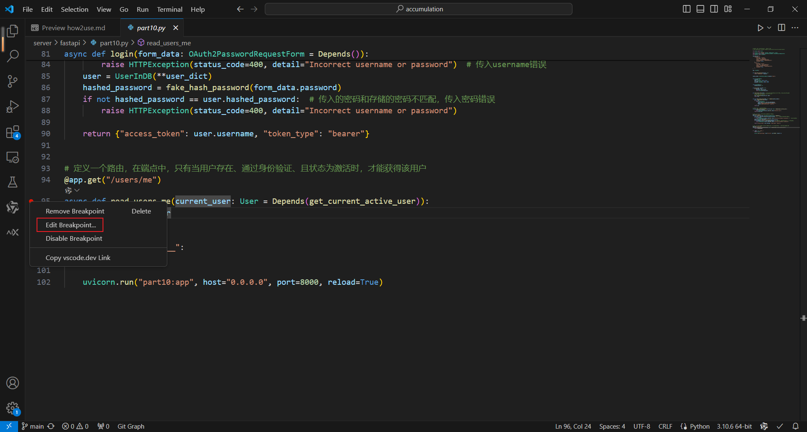
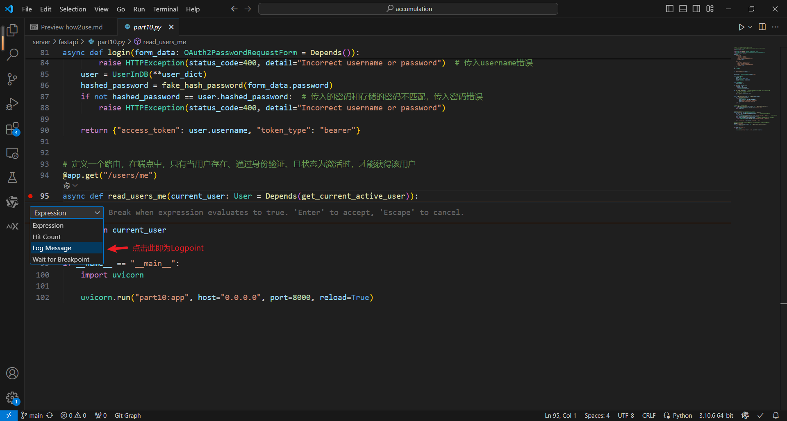
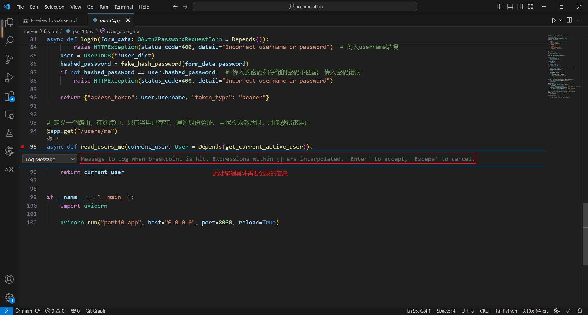

**本文档用于记录VSCoder debug相关笔记**

- [Logpoints](#Logpoints)
  - 
- 
  - 
  - 

官方链接：
 - [https://code.visualstudio.com/docs/editor/debugging#_debug-actions](https://code.visualstudio.com/docs/editor/debugging#_debug-actions)
 - [https://code.visualstudio.com/docs/python/debugging](https://code.visualstudio.com/docs/python/debugging)

# Logpoints
&emsp;&emsp;Logpoint是Breakpoint的变体，它不会“中断”调试器，而是将消息记录到控制台。Logpoint对于在调试无法暂停或停止的生产服务器时注入日志记录特别有用。实际功能相当于隐式的print

&emsp;&emsp;Logpoint的信息是纯文本，但可以包含要在大括号 ('{}') 内计算的表达式，类似与f"{}"字符串语法。在python中，先鼠标左键代码前最前端添加一个Breakpoint，出现红点后，鼠标右键红点，再点击其中的“Edit Breakpoint”，选择“Log Message”即将Breakpoint转换为Logpoint，可设置“具体的记录信息”。

